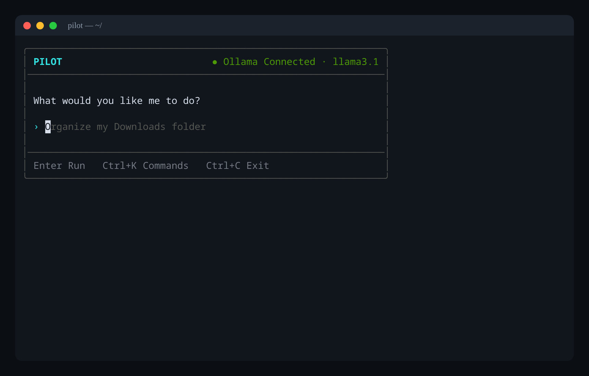
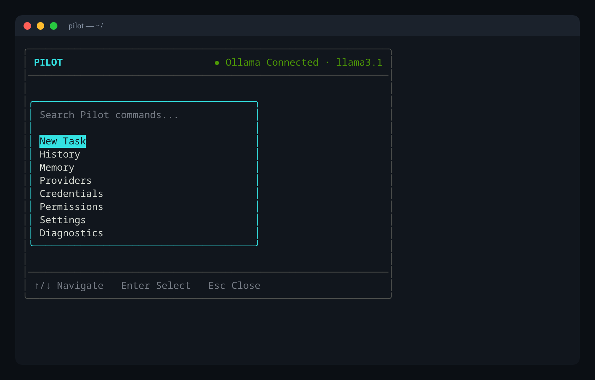
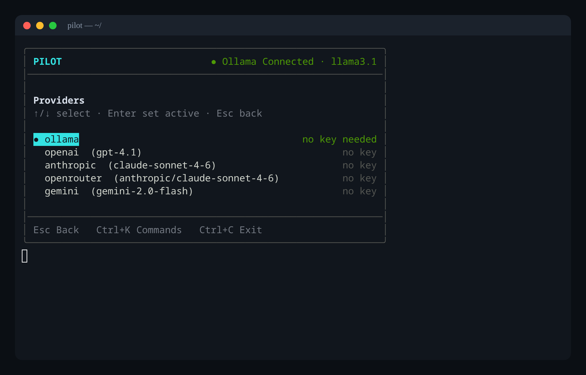
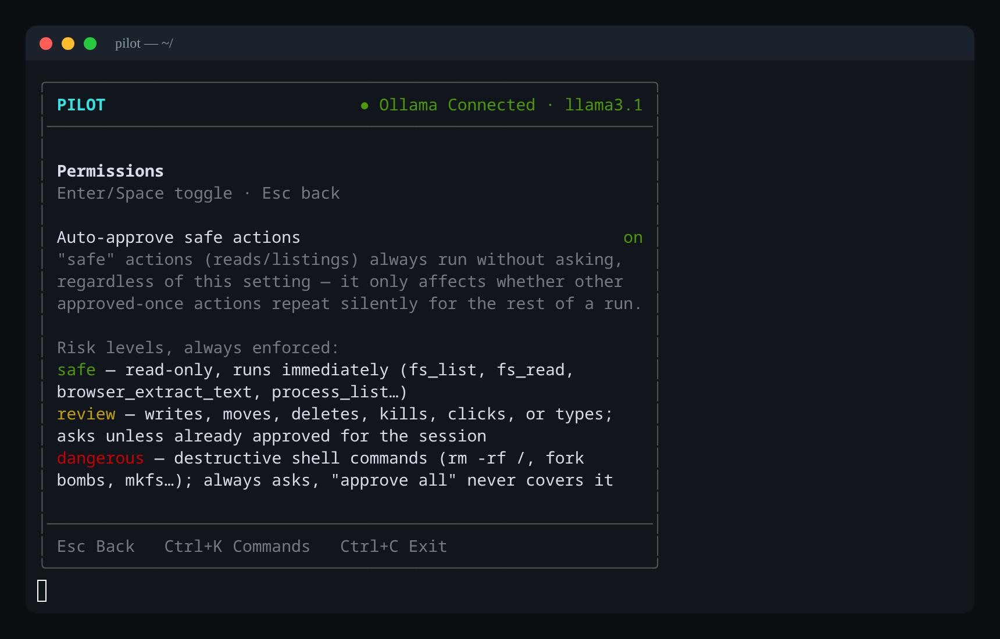
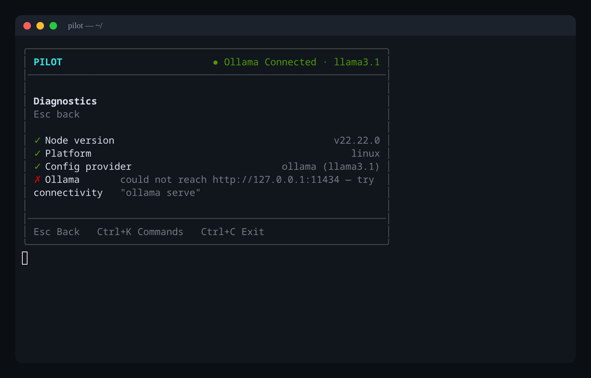
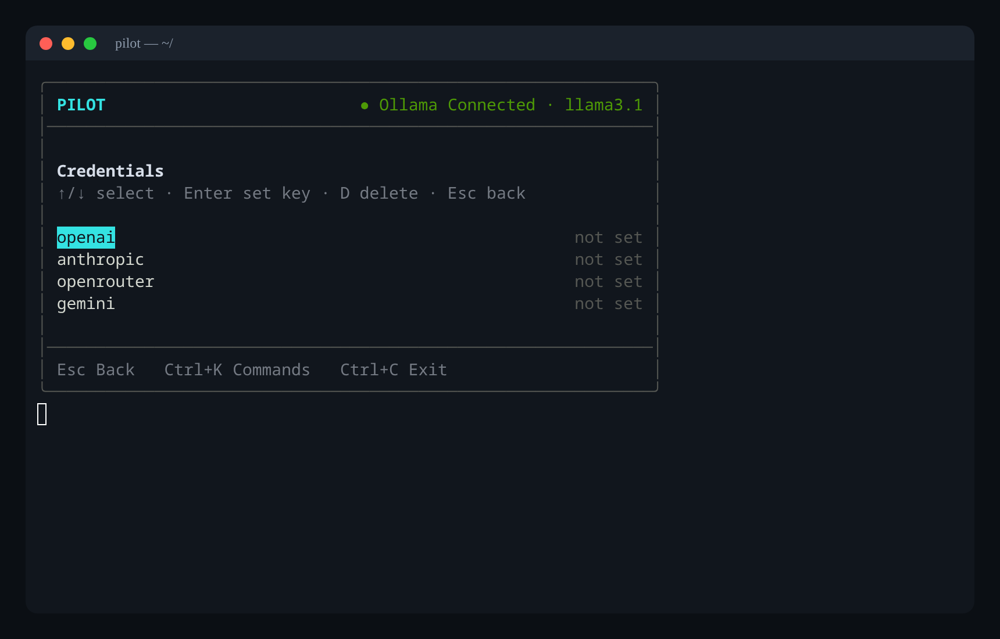
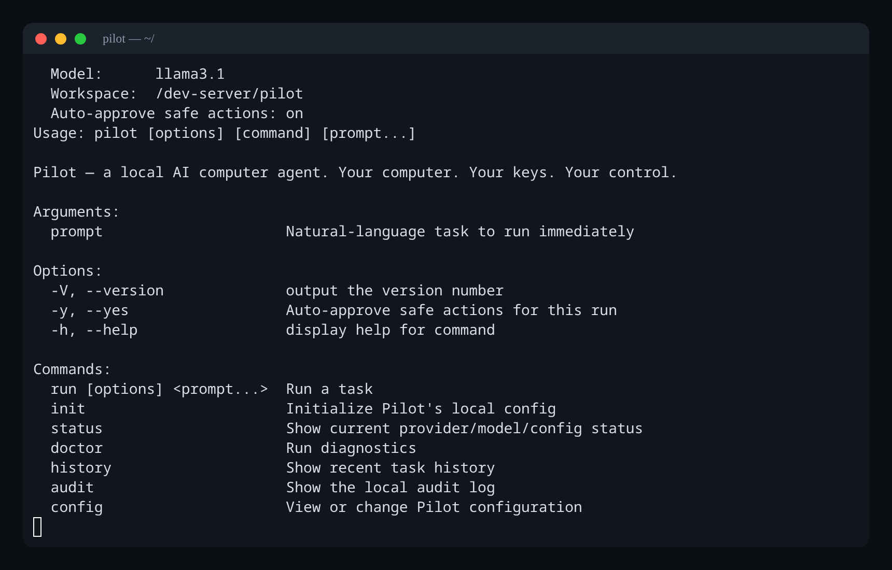

<h1 align="center">Pilot</h1>

<p align="center"><strong>Your computer. Your keys. Your control.</strong></p>

<p align="center">
  An open-source AI computer agent that lives in your terminal — local-first, BYOK, and permission-gated.
</p>

<p align="center">
  
  
  
  
</p>

<p align="center">
  
</p>

Pilot is a local, terminal-based AI agent for your computer. Tell it what you
want done in plain English — organize a folder, run your tests, find a file
from last week — and Pilot inspects your machine, proposes a plan, asks for
approval on anything risky, and executes it. Entirely on your machine.

```bash
npm install -g pilot-agent
pilot
```

## Try it without installing

```bash
npx pilot-agent
```

## Screenshots

| Command palette (`Ctrl+K`) | Providers |
| --- | --- |
|  |  |

| Permissions & risk model | Diagnostics (`pilot doctor`) |
| --- | --- |
|  |  |

| Credentials (BYOK, never displayed) | Non-interactive CLI |
| --- | --- |
|  |  |


## Why Pilot

- **Local-first.** The agent loop, tool execution, memory, and config all run
  on your machine. Use [Ollama](https://ollama.com) for a fully local model,
  or bring your own key for OpenAI, Anthropic, OpenRouter, or Gemini.
- **Your keys stay yours.** API keys are encrypted at rest on disk and are
  never sent to a Pilot-owned server (there isn't one), logged, printed, or
  placed into model prompts. See [`docs/security.md`](docs/security.md).
- **Nothing risky happens without you.** Every filesystem write, delete,
  move, or shell command is risk-classified and shown to you before it runs.
  You can approve once, approve for the rest of the session, or deny.
- **Everything is logged.** A local, human-readable audit trail
  (`pilot audit`) and task history (`pilot history`) record exactly what
  Pilot did.

## Install

```bash
npm install -g pilot-agent
pilot init
```

## Quick start

```bash
# Fully local, no API key needed
ollama serve
ollama pull llama3.1        # only needed once, downloads the model
pilot config provider ollama
pilot

# Or bring your own key
pilot config provider anthropic
pilot config keys set anthropic
pilot "find all screenshots related to my current project"
```

## CLI reference

```bash
pilot                          # open the interactive TUI
pilot "organize my downloads"  # run a task directly
pilot run "run tests in my project"

pilot init                     # create ~/.pilot/config.json
pilot status                   # show current provider/model
pilot doctor                   # verify provider connectivity

pilot config provider [name]   # get/set provider
pilot config model [name]      # get/set model
pilot config keys list
pilot config keys set <provider>
pilot config keys delete <provider>

pilot history                  # recent tasks
pilot audit                    # local action audit log
```

## Troubleshooting

- **`Ollama error (404): model 'llama3.1' not found`** — Ollama is running but
  doesn't have that model downloaded yet. Run `ollama pull llama3.1`, or point
  Pilot at a model you already have with `pilot config model <name>` (see
  installed models via `ollama list`).

## Supported providers

| Provider   | Requires API key | Notes                          |
|------------|:-----------------:|---------------------------------|
| Ollama     | No                | Fully local, default provider   |
| OpenAI     | Yes               |                                  |
| Anthropic  | Yes               |                                  |
| OpenRouter | Yes               | Access to many hosted models    |
| Gemini     | Yes               |                                  |

## Tools

Pilot's agent loop can call:

- **Filesystem** — `fs_list`, `fs_read`, `fs_write`, `fs_move`, `fs_delete`, sandboxed to
  the workspace root (see [`docs/security.md`](docs/security.md)).
- **Terminal** — `terminal_exec`, with dangerous commands classified `dangerous` and
  provider-credential env vars stripped from the child process.
- **Process** — `process_list`, `process_kill`.
- **Browser** — `browser_open`, `browser_click`, `browser_type`, `browser_extract_text`,
  `browser_screenshot`, `browser_close`, backed by headless Chromium via Playwright. One
  browser session is reused across a task and closed automatically when the task ends.
  Chromium binaries aren't downloaded by `npm install` — run this once:

  ```bash
  npx playwright install chromium
  ```

Every command panel from the TUI's command palette (`Ctrl+K`) — Providers, Credentials,
Permissions, Settings, Diagnostics, History, Memory — has a dedicated screen; there's also
a CLI equivalent for each (`pilot config …`, `pilot doctor`, `pilot history`).

## Architecture

See [`docs/architecture.md`](docs/architecture.md) for how the agent loop,
tool registry, and TUI fit together, and
[`docs/providers.md`](docs/providers.md) for adding a new provider.

## Development

```bash
git clone https://github.com/adamyasingh-05/Pilot.git
cd Pilot
npm install
npm run dev -- "list files in the current directory"
npm test
```

## Contributing

Contributions are welcome! Please read [`CONTRIBUTING.md`](CONTRIBUTING.md) and our
[`CODE_OF_CONDUCT.md`](CODE_OF_CONDUCT.md) before opening a pull request.

## Security

Found a vulnerability? See [`SECURITY.md`](SECURITY.md) for how to report it responsibly.

## License

MIT — see [LICENSE](LICENSE).
